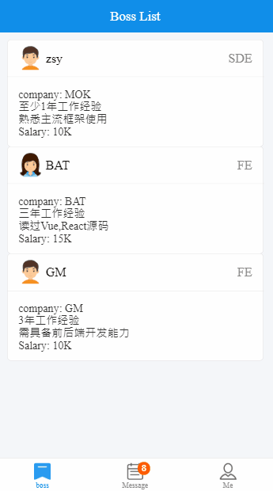
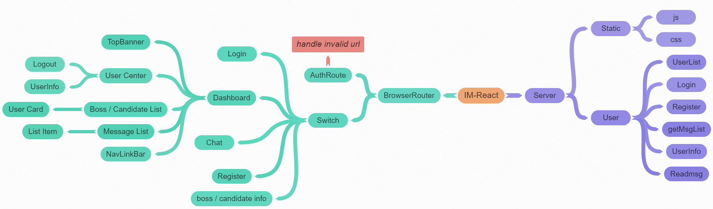

### IM-React

------

 [](https://github.com/prettier/prettier)

[TOC]

#### Intro

An Instant messaging application made with React.js(React-Router4/Redux), Node.js(Express), MongoDB and Socket.io, learning purpose.

This app use the NoSQL database to store the users' infos and chat histories, and It has the following features:

- Support instant chat, multiple users
- Unread messages hint
- Emoji support
- Enhanced md5 encryption
- Antd-mobile and motion Antd-mobile
- Auto scroll to latest message

##### 

#### Preview

More details, please click 👉  [here](http://47.104.228.220:9001/login) for online preview.

you can test react / GM etc, pwd: 123




#####

#### Libraries and tools used in the project

- [x] ES6

- [x] React, Redux, React-Router and create-react-app (webpack)

  - Redux:  

    ​	combineReducers -- combine different reducers

    ​	compose -- compose the middlewares etc...(from right to left)

    ​	createStore -- create store with combined reducers and composed middlewares(enhancer).

    ​	provider -- provide the store to the components

    ​	applyMiddleware -- mostly, apply the middlewares such as thunk to support asynchronous actions.

  

  - React Router: 

    ​	BrowserRouter -- use the HTML5 history API (pushState/replaceState/popstate) to keep the UI in sync with URL

    ​	Redirect -- Rendering a Redirect to navigate to a new location. the new location will override the current location in the history stack.

    ​	Route -- Render the specific UI when a location matches the router's path

    ​	Switch -- Render the first child <Route> or <Redirect> that matches the location

    ​	history -- history objects methods such as push / replace / goBack.

    ​	location -- represents where the app is now

    ​	match -- can be accessed from Route / WithRouter components

  ​	WithRouter -- is a higher-order component, let the wrapped component get access to the history object's properties and the closet <Route>'s match

   

- [x] Express

  -  connect socket with express

    ​	`const server = require('http').Server(app)`

    ​	`const io = require('socket.io')(server)`

  - configure route

    ​	`app.use(express.static(path.resolve('build')))`

- [x] MongoDB

  - create model

    ​	`mongoose.model(m, new mongoose.Schema(models[m]))`

  - find element

    ​	`find({}) / find($or:[{},{}])`

    ​	`findByIdAndUpdate / findOne`

  - update

    ​	`update({},{$set :{ }},{multi: true})`

- [x] Socket.io

  ​		`io.on('connect') / io.emit() `

  ​		`socket.on() / socket.emit() / socket.once()`

  ​		`socket.connect() / socket.disconnect() / socket.removeAllListeners()`

##### 

#### UI

- Login
  - Logo
  - Login / Register
- Register
  - User info
  - Details
- Dashboard
  - Top Banner
  - boss list / candidate list
  - message list
  - me (user center)
  - NavLinkBar
- Boss / Candidate List
  - User Card
- Message List
  - List Item
  - Badge
- User Center
  - Job Description / Personal Portfolio
  - Logout





##### 

#### Difficulties encountered 

```
1. redux async management
use the thunk middleware

2. antd mobile config
.babelrc need to set 
modify the package.json also

3. socket emit multiple times
each socket.on will be triggered by io.emit

4. unread message nums
trigger read based on from / to is the current userid
call recvmsgs actions once display to calculate unread nums

5. auto scroll to the last element
add a div in the bottom of the list
use the scrollIntoView

6. Make proper data structure
understand what should be props and states
message set to proper group

7. performance best practise
use gzip, for express, can simplely use the compression middleware
```

